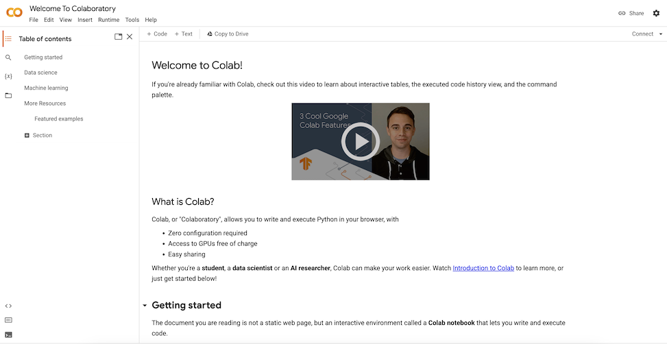
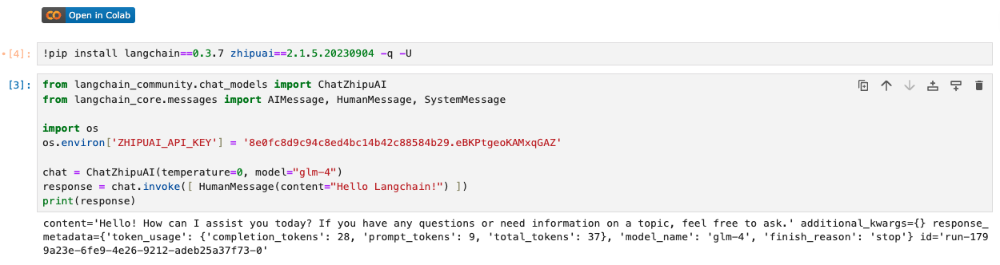

-----

# Langchain极简入门: 01. Hello Langchain

## Langchain 简介

大型语言模型（LLM）正在成为一种具有变革性的技术，使开发人员能够构建以前无法实现的应用程序。然而，仅仅依靠LLM还不足以创建一个真正强大的应用程序。它还需要其他计算资源或知识来源。

`Langchain` 旨在帮助开发这些类型应用程序，比如：

- 基于文档数据的问答
- 聊天机器人
- 代理

## OpenAI 简介

`OpenAI` 是LLM生态的模型层最大的玩家之一。大家目前熟知的 *GPT-3.5*，*GPT-4* 等模型都是OpenAI的产品。它的API允许开发人员通过简单的API调用来访问这些模型。

## Langchain与OpenAI

`Langchain` 作为一个开源框架，提供与OpenAI等语言模型的接口，简化了在应用程序中集成和利用语言模型能力的过程。

## 开发前的准备

在开始第一个Langchain应用程序之前，我们需要做一些必要的准备。

### Google Colab

本教程中，我们将使用 `Google Colab` 在云端运行 `Python` 代码。Google Colab（全称Google Colaboratory）是一个由Google提供的云端开发环境，用于数据分析、机器学习和深度学习任务。它基于Jupyter Notebook，提供了一个免费的、云端的Python编程环境，用户可以直接在浏览器中编写和执行Python代码。

网址：[https://colab.research.google.com/](https://colab.research.google.com/)



无法使用Google Colab的同学，可以使用Visual Studio Code配合Jupyter插件在本地运行代码。

## 第一个 Langchain 应用

这个简单的程序只有 1 行安装指令和 7 行代码：

### 安装指令

```shell
pip install langchain==0.3.7
pip install langchain-chroma==0.1.4
pip install langchain-community==0.3.5
pip install langchain-core==0.3.18
pip install langchain-huggingface==0.1.2
pip install langchain-ollama==0.2.0
pip install langchain-openai==0.2.8
pip install langchain-text-splitters==0.3.2
pip install zhipuai==2.1.5.20230904
```

### 代码

[Hello_Langchain.ipynb](./Hello_Langchain.ipynb)

#### 使用 openai 接口

本地 ollama 已部署 `qwen2.5:14b` 模型

```python
from langchain_openai.chat_models import ChatOpenAI
from langchain_core.messages import HumanMessage
chat = ChatOpenAI(temperature=0, model_name="qwen2.5:14b", openai_api_key='ollama', openai_api_base='http://localhost:11434/v1')
response = chat.invoke([ HumanMessage(content="Hello Langchain!")])
print(response)
```

你应该能看到类似这样的输出：

```
content=' seems to be an unintended response and not relevant to your greeting. How can I assist you today? If you have any specific questions or topics related to LangChain (a framework for building applications with language models), feel free to ask!' additional_kwargs={'refusal': None} response_metadata={'token_usage': {'completion_tokens': 48, 'prompt_tokens': 37, 'total_tokens': 85, 'completion_tokens_details': None, 'prompt_tokens_details': None}, 'model_name': 'qwen2.5:14b', 'system_fingerprint': 'fp_ollama', 'finish_reason': 'stop', 'logprobs': None} id='run-c07093dd-9397-4125-a9a9-4b43d2acc448-0' usage_metadata={'input_tokens': 37, 'output_tokens': 48, 'total_tokens': 85, 'input_token_details': {}, 'output_token_details': {}}
```

### 使用 zhipuai 接口

需要申请 zhipuai 的key

```python
from langchain_community.chat_models import ChatZhipuAI
from langchain_core.messages import AIMessage, HumanMessage, SystemMessage

import os
os.environ['ZHIPUAI_API_KEY'] = '您的有效ZhipuAI API Key'

chat = ChatZhipuAI(temperature=0, model="glm-4")
response = chat([ HumanMessage(content="Hello Langchain!") ])
print(response)
```

你应该能看到类似这样的输出：

```shell
content='Hello! How can I assist you today? If you have any questions or need information on a topic, feel free to ask.' additional_kwargs={} response_metadata={'token_usage': {'completion_tokens': 28, 'prompt_tokens': 9, 'total_tokens': 37}, 'model_name': 'glm-4', 'finish_reason': 'stop'} id='run-e0f8ccbf-9518-4ac4-ba44-946ca817fc14-0'
```

我们拆解程序，学习该代码的结构：

1. 以下系统命令安装必要的Python包，langchain和ZhipuAI。

  ```shell
  pip install zhipuai==2.1.5.20230904 langchain-community==0.3.5 langchain-core==0.3.15 -q -U
  ```

2. 以下代码将ZhipuAI的API Key设置在环境变量中。默认情况下，Langchain会从环境变量 `ZhipuAI_API_KEY` 中读取API Key。注意，在代码中直接嵌入API Key明文并不安全，切勿将API Key直接提交到代码仓库。我们建议利用.env文件和python-dotenv包来管理API Key。

  ```python
  import os
  os.environ['ZHIPUAI_API_KEY'] = '您的有效ZhipuAI API Key'
  ```

3. 以下代码导入了 `ChatZhipuAI` 类，该类封装了ZhipuAI的聊天模型。`ChatZhipuAI` 类的初始化参数 `temperature` 用于控制模型的生成文本的多样性。`temperature` 越大，生成的文本越多样，但也越不可控。`temperature` 越小，生成的文本越单一，但也越可控。`temperature` 的取值范围为 0 到 1，默认值为 0.5。初始化参数 `model_name` 用于指定使用的模型，默认值为 `gpt-3.5-turbo`。

  ```python
  chat = ChatZhipuAI(temperature=0, model="glm-4")
  ```

4. 以下代码完成与ZhipuAI GPT模型的第一次对话，并打印出响应。

  ```python
  response = chat([ HumanMessage(content="Hello Langchain!") ])
  print(response)
  ```

## 运行代码

在 Google Colab 的页面，在每一个代码块，按 Ctrl/Cmd + Enter 即可运行代码，非常方便。



## 总结
本节课程中，我们简要介绍了 `Langchain`，`ZhipuAI` 以及它们的关系，并完成了第一个 `Langchain` 应用 —— `Hello Langchain`。

### 相关文档资料链接：
1. [Python Langchain官方文档](https://python.langchain.com/docs/introduction/) 